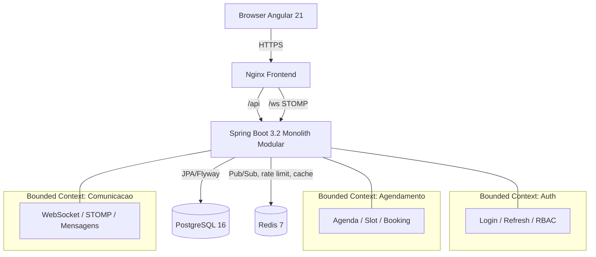
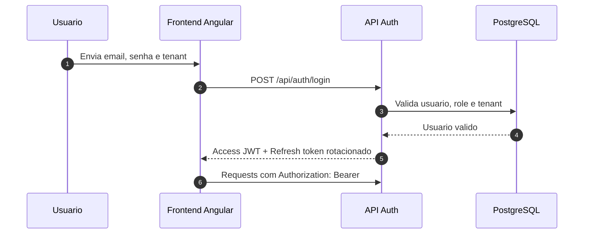

# ClickSmile MVP Architecture

## Objetivo

Base de arquitetura para um MVP web-first, multitenant B2B2C, com foco em agendamento odontologico, autenticacao segura e chat em tempo real.

## Principios

- Monolito modular com DDD pragmatizado para MVP.
- Isolamento por tenant em todas as tabelas operacionais.
- Autenticacao stateless com JWT curto e refresh token rotacionado.
- Web como canal principal; mobile fica para evolucao futura.
- Seguranca por padrao: CORS restrito, CSRF controlado, rate limiting e criptografia de dados sensiveis.

## Contextos Delimitados

### 1. Autenticacao e Identidade

Responsavel por login, refresh, logout, RBAC, escopo de tenant e emissao de tokens.

Subdominios:

- Cadastro e ativacao de usuarios.
- Login por email e senha com verificacao de tenant.
- Emissao de access token JWT assinado com RSA-256.
- Refresh token opaco persistido com hash e rotacao obrigatoria.
- Autorizacao por roles e permissoes.

### 2. Agendamento

Responsavel por agenda, slots, disponibilidade, reservas, reagendamento e cancelamento.

Subdominios:

- Agenda do dentista.
- Regras de disponibilidade e bloqueio de horario.
- Criacao de agendamento com validacao de conflito.
- Mudanca de status com trilha de auditoria.

### 3. Comunicacao

Responsavel por chat B2B2C entre clinica, profissional e paciente.

Subdominios:

- Conversas por atendimento ou relacionamento recorrente.
- Mensagens em tempo real via WebSocket/STOMP.
- Persistencia da conversa no PostgreSQL.
- Broadcast horizontal via Redis Pub/Sub.

## Fluxo de Dados

### Login

1. Frontend envia credenciais e tenant.
2. Backend valida usuario, status, role e tenant.
3. Backend emite access token JWT curto e refresh token opaco.
4. Refresh token e armazenado com hash no banco.
5. Frontend usa access token no header Authorization.
6. Refresh ocorre em endpoint protegido com CSRF e cookie HttpOnly, se essa estrategia for adotada.

### Criacao de Agendamento

1. Frontend envia requisicao autenticada com tenant implicito no token.
2. Backend seta o contexto de tenant na conexao e valida permissao.
3. Agendamento e gravado com restricao de conflito no banco.
4. Evento de dominio e publicado para notificacoes e chat.

### Chat

1. Cliente abre WebSocket autenticado com JWT.
2. Conexao STOMP e associada ao tenant e a conversa.
3. Mensagem entra no backend, e persistida no PostgreSQL.
4. Backend publica evento no Redis Pub/Sub.
5. Todas as instancias recebem o evento e fazem fan-out para os WebSockets locais.

## Multitenancy

Estrategia recomendada para o MVP:

- Banco unico e schema unico.
- Coluna tenant_id em todas as tabelas operacionais.
- Indices compostos por tenant_id.
- Row Level Security no PostgreSQL como camada adicional de defesa.
- O backend deve setar app.tenant_id por request, idealmente via filtro + interceptor transacional.

### Regras de isolamento

- Nenhuma consulta de negocio deve depender apenas de filtro da API.
- Toda tabela sensivel precisa de FK para tenant_clinica.
- Recursos globais como roles podem ser compartilhados, mas acesso deve ser resolvido por tenant.

## Seguranca e Conformidade

### JWT RSA-256

- Access token curto: 15 minutos.
- Refresh token: 30 dias, rotacionado a cada uso.
- Chave privada RSA fora do repo, idealmente em secret manager.
- Chave publica usada para validacao interna e possiveis consumidores.

### CSRF

- APIs puramente Bearer token podem ser stateless e sem CSRF para endpoints de leitura e escrita via Authorization header.
- Se refresh token usar cookie HttpOnly, aplicar CSRF somente nos endpoints de refresh e logout.
- SameSite=Strict ou Lax, Secure e HttpOnly obrigatorios.

### CORS

- Apenas origens conhecidas do frontend web.
- Nada de wildcard em producao.
- Permitir somente metodos e headers necessarios.

### Rate Limiting

- Bucket4j para login, refresh, envio de mensagem e criacao de agendamento.
- Chave de limitacao combinando IP, tenant e usuario quando aplicavel.
- Armazenamento distribuido via Redis para escalar horizontalmente.

### Criptografia de dados medicos em repouso

- Disco/volume com criptografia no ambiente de infraestrutura.
- Segredos e chaves fora do repositório.
- Campos clinicos sensiveis e mensagens podem ser criptografados na aplicacao com AES-256-GCM e envelope encryption.
- Backups devem ser criptografados separadamente.

## Chat Real-Time

### Topologia

- Browser conecta em /ws via Nginx.
- Nginx faz proxy para o backend.
- Backend autentica o handshake com JWT.
- Instancias backend usam Redis Pub/Sub para propagar mensagens.

### Topicos sugeridos

- tenant.{tenantId}.chat.{conversationId} para fan-out de conversa.
- tenant.{tenantId}.presence.{userId} para presenca opcional.

### Regras de entrega

- Persistir primeiro, publicar depois.
- Ack visual no frontend e confirmacao de entrega/lido em eventos posteriores.
- Mensagens sem sucesso de broadcast permanecem no banco e entram em retry via consumidor interno.

## Estrutura de Pacotes Java

Base recomendada:

```text
com.clicksmile
  ClickSmileApplication
  shared
    config
    security
    tenancy
    exception
    auditing
    events
    validation
  modules
    auth
      api
      application
      domain
      infrastructure
    scheduling
      api
      application
      domain
      infrastructure
    communication
      api
      application
      domain
      infrastructure
    tenants
      api
      application
      domain
      infrastructure
```

### Dependencias entre camadas

- api chama application.
- application orquestra casos de uso e transacoes.
- domain guarda regras puras.
- infrastructure implementa persistencia, mensageria e integracoes externas.

## Estrutura Web recomendada

Frontend Angular web-first:

```text
src/app
  core
    auth
    http
    guards
    interceptors
    websocket
  shared
    ui
    pipes
    directives
    models
  features
    auth
    dashboard
    scheduling
    chat
  layouts
```

## Diagrama logico



## Sequencia de autenticacao



## Topologia de infraestrutura

- frontend: Nginx servindo SPA e proxyando /api e /ws.
- backend: container Java 21 com monolito modular.
- postgres: volume persistente e sem acesso publico direto por padrao.
- redis: volume persistente para AOF e uso interno de pub/sub.
- redes separadas para edge, app e data.

## Observacoes de MVP

- O sistema e web-first por decisao de produto.
- Mobile pode nascer depois consumindo a mesma API.
- O monolito modular reduz custo operacional sem sacrificar limites de contexto.
- Quando o volume de chat crescer, o Redis Pub/Sub pode evoluir para stream/consumer groups sem refatorar o contrato externo.